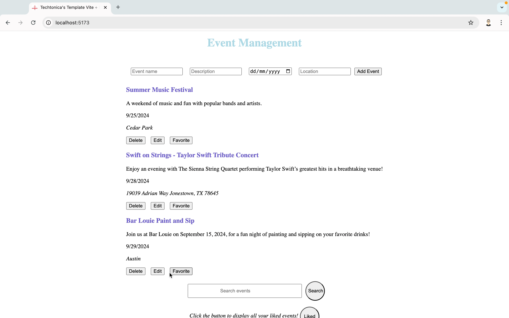

# Event Management App

## Description

Event Management is a full-stack web application built with React, Express, PostgreSQL, and Jest. It allows users to create, edit, delete, and search for events. Users can also mark events as favorites and view a list of favorite events. This project demonstrates front-end and back-end integration, database management, and basic testing using Jest.

## Features

- **Add Event**: Users can create new events with details like name, description, date, and location.
- **Edit Event**: Users can edit the details of an existing event.
- **Delete Event**: Users can remove events from the list.
- **Search Events**: Search for events by name or location.
- **Favorite Events**: Mark events as favorites and view a list of favorite events.
- **Testing**: Basic unit tests written using Jest to ensure component functionality.

## Demo


_User put new event information and hit Add Event button to add an new event_


_User hit the Edit button to edit event, hit Save Changes button to save changes_

## Technologies Used

- **Front-End**:

  - [React](https://reactjs.org/): A JavaScript library for building user interfaces.
  - [React Hooks](https://reactjs.org/docs/hooks-intro.html): State and lifecycle features using hooks like `useState`, `useEffect`, `useReducer` and `useContext`.
  - [Jest](https://jestjs.io/): A testing framework for JavaScript.
  - [React Testing Library](https://testing-library.com/docs/react-testing-library/intro): For testing React components.

- **Back-End**:
  - [Express](https://expressjs.com/): A minimal Node.js web application framework for handling routes and HTTP requests.
  - [PostgreSQL](https://www.postgresql.org/): An open-source relational database to store event data.
  - [Node Fetch](https://www.npmjs.com/package/node-fetch): For making API requests to the back-end.

## Installation and Setup

### Prerequisites

Make sure you have the following installed:

- [Node.js](https://nodejs.org/en/download/)
- [PostgreSQL](https://nodejs.org/en/download/)

### Steps to Set Up the Project Locally

1. **Clone the Repository**:

   ```bash
   git clone https://github.com/Xhz0729/techtonica-assignments.git
   cd event-project
   ```

2. **Install Dependencies**:
   Navigate to both the client and server directories and install the dependencies:

   ```bash
   cd client
   npm install
   cd ../server
   npm install
   ```

3. **Set Up the Database**:

   - Create a PostgreSQL database for your project.
   - In your server directory create a `.env` file.
   - Add your database credentials to the `.env` file in the server directory by following (server/.envexample) :
     ```
     DB_URI="postgresql://localhost/<database>"
     ```

4. **Run the Application**:
   - In the `server` directory:
     ```bash
     npm run dev
     ```
     The server will run on `http://localhost:8080` and the React client will run on `http://localhost:5173`.

## Running Tests

This project uses Jest for testing components. To run the tests, use the following command in the `client` directory:

```bash
npm test
```

## Project Structure

```
event-project/
│
├── client/                    # Front-end React app
│   ├── src/                   # React component source code
|   |    ├──__tests__/            # Jest tests for components
|   |    ├── components/          # components
|   |    ├── helper/              # context helper
|   ├── public/                # Static files (e.g., index.html)
│   ├── package.json           # Front-end dependencies
│
├── server/                    # Back-end Express app
│   ├── server.js              # Express server source code
│   ├── controller/            # Route logic controllers
│   ├── db/                    # Database-related code
│   ├── routes/                # routes
│   ├── package.json           # Back-end dependencies
│   ├── .env                   # Environment variables (for database credentials)
│
├── README.md                  # Project readme file
└── .gitignore                 # ignore files set up

```

## Endpoints

| Method | Endpoint           | Description                    |
| ------ | ------------------ | ------------------------------ |
| GET    | `/events`          | Get all events                 |
| POST   | `/events`          | Add a new event                |
| PUT    | `/events/:id`      | Edit an existing event         |
| DELETE | `/events/:id`      | Delete an event                |
| GET    | `/events/search`   | Search events by name/location |
| GET    | `/events/favorite` | Get all favorite events        |

## Tests Implemented

I only write two tests for component `AddEventForm`

1. **Component Rendering Tests**: Ensuring component render correctly.
2. **Form Submission Tests**: Testing that the form submission triggers the right actions and resets the form.

## Possible Improvements

- **Authentication**: Add user login and registration functionality.
- **Date format**: Add specific hours for event data.
- **Filtering**: Add more filters (by date, location, etc.).
- **Styling**: Improve the UI/UX with more advanced design patterns.

## Acknowledgments

- Thanks to [Techtonica](https://www.techtonica.org/) for providing guidance and inspiration for this project.
