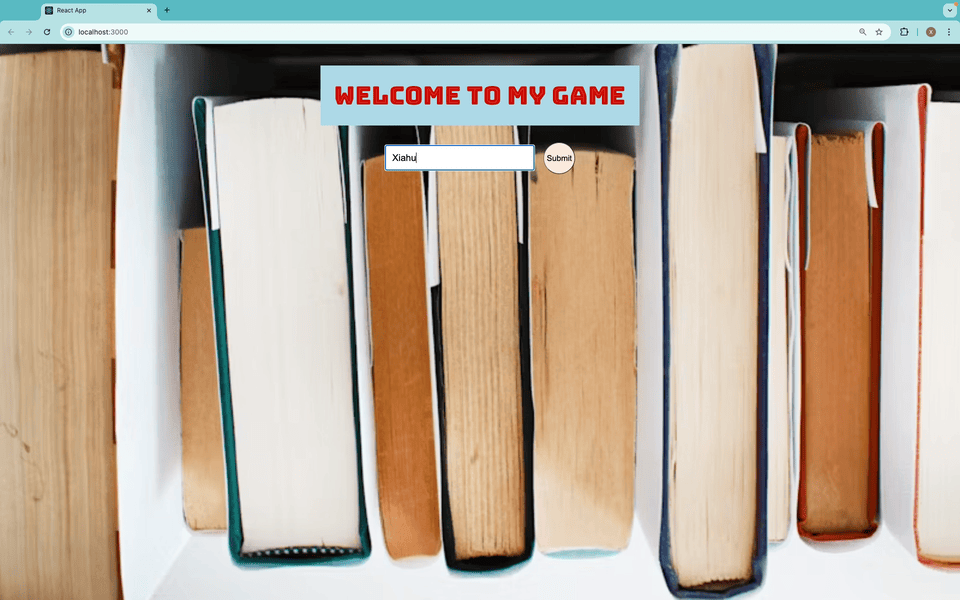

# Trivia Game App

This project is a minimal trivia game that connects the backend (Node.js and Express) with the frontend (React). The game fetches trivia questions from the Trivia API, allows the user to answer them, and update the user's score based on the user's answer.

## Project Structure

- **Backend**: Located in the `server` folder, built using Node.js and Express. The backend fetches trivia questions from the Trivia API.
- **Frontend**: Located in the `client` folder, built using React. The frontend displays the game to the user, handles user input, and update user's score.

## Demo


_User entering name and starting the quiz_


_Questions displayed with answer buttons_


_Final score and restart button_

## Components

The app is divided into three main components:

1. **User Component**:

   - Collects user information (e.g., name).
   - Displays a welcome message personalized with the user's input.

2. **Quiz Component**:

   - Fetches real-time trivia questions from the backend using the Trivia API.
   - Displays quiz questions and handles user responses.
   - Implements the logic to check whether the user's answers are correct or incorrect, updates the score accordingly, and alerts the correct answer when necessary.

3. **Ending Component**:
   - Displays the final score.
   - Includes a "Restart" button to reset the game and navigate back to the start page.

## Styling

All styles are centralized in `App.css`. The game is designed with responsive styling to ensure a good experience across different screen sizes:

- Special attention has been given to screens with a width of less than 430px, making the app suitable for mobile devices.

## Environment Variables

This project uses an `.env` file to store the Trivia API URL for fetching questions. Here's how it's set up:

1. In the root of the `server` folder, create an `.env` file:

```bash
touch .env
```

2. Add the Trivia API URL to the `.env` file:

```bash
URL=Trivia_API_URL
```

Attention, please limit your question number to 5 and limit your question type to True/False.

3. In `server/index.js`, load the environment variable like this:

```javascript
const apiUrl = process.env.URL;
```

This keeps the API URL secure and allows easy changes to the trivia settings (e.g., amount, category, difficulty).

## Features

1. **Real-Time Trivia**: The app fetches trivia questions from the Trivia API and dynamically displays them in the quiz.
2. **Score Tracking**: It tracks the number of correct and incorrect answers, showing the user's final score at the end.
3. **Responsive Design**: The app adapts to various screen sizes, including mobile.

## How the Game Works

1. The game starts by collecting the user's information via the **User Component**.
2. Once the game begins, the **Quiz Component** fetches trivia questions from the Trivia API and displays them to the user. The component handles logic for checking answers, updating the score, and alerting the correct answer.
3. After all questions have been answered, the **Ending Component** displays the user's score.
4. The user can restart the game by clicking the "Restart" button.

## Installation and Setup

1. Clone the repository:

```bash
git clone https://github.com/Xhz0729/techtonica-assignments.git
```

2. Navigate to the `server` folder and install backend dependencies:

```bash
cd quiz-game
cd server
npm install
```

3. Create an `.env` file in the `server` folder and add your API URL , refer to above Environment Variables part.

4. Navigate to the `client` folder and install frontend dependencies:

```bash
cd ../client
npm install
```

5. Start the backend server and frontend server together:

```bash
cd server
npm run dev
```

6. Open the app in your browser at `http://localhost:3000`.

## Future Improvements

- Add more advanced question categories and difficulty levels.
- Add win or lose logic, communicates the score back to the backend to determine if the user won or lost
- Improve styling and animations for a more engaging user experience.
