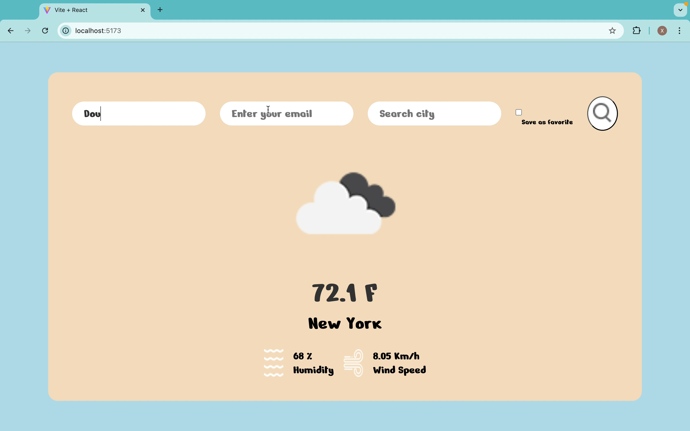

# 🌤️ Weather App

This **Weather App** is a full-stack web application that allows users to fetch live weather data using the OpenWeather API. Users can input their username, email, select a favorite city and search for a specific city. The selected favorite city, along with the user's information, is stored in a PostgreSQL database. The application displays basic user information, including their name and favorite city.

The app is built using the PERN stack (PostgreSQL, Express, React, and Node.js) to manage both frontend and backend functionality. The React frontend allows users to interact with the application, while the Express and Node.js backend handles API requests and database operations.

## 📝 Project Features

- **Weather data fetch**: User can fetch live weather data of a city from the OpenWeather API based on the city input.
- **Data collection**: Store user information and their favorite city in a PostgreSQL database.
- **Information display**: Display user details such as name and favorite city after form submission.

## 🚀 Technologies Used

- **Frontend**: React
- **Backend**: Node.js, Express.js
- **Database**: PostgreSQL
- **Styling**: Custom CSS for a clean and modern UI

## 🌟 demos


_User input username, email, city and check the favorite checkbox to show user basic info and live weather data_

## 🛠️ Setup and Installation

### Prerequisites

- Node.js
- PostgreSQL

1. **Clone the Repository:**

   ```bash
   git clone https://github.com/Xhz0729/techtonica-assignments.git
   ```

2. **Navigate to the Project Directory:**

   ```bash
   cd techtonica-assignments
   cd weather-app
   ```

3. **Install Dependencies:**

   - **Server:**

     ```bash
     cd server
     npm install
     ```

   - **Client:**

     Open a new terminal, then:

     ```bash
     cd ..
     cd client
     npm install
     ```

4. **Setup PostgreSQL Database**
   Create a PostgreSQL database and add the table users.

Run the SQL commands provided in `weatherdb_dump.sql` to set up the database schema.

5. **Setup .env for API and db connection**
   Go to server and create a .env file: -**API connection:**
   API_KEY=YOUR_API_KEY

   -**DATABASE connection:**
   DATABASE_URI="postgresql://localhost/your_database_name"

6. **Start the Development Server**

```bash
cd server
npm run dev
```

This will start both the server and client using the `concurrently` package.

## 🤝 Contributions

Feel free to submit pull requests or suggest improvements. All contributions are welcome!
