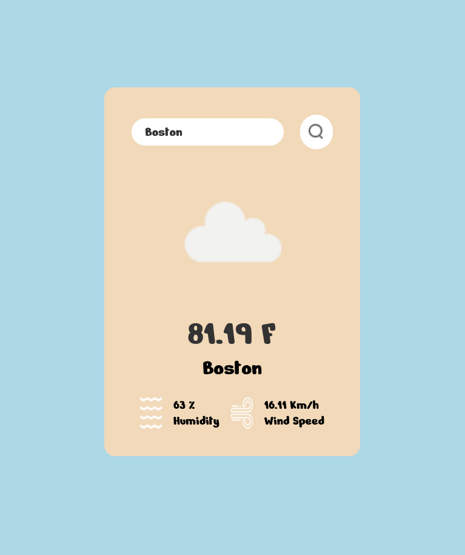

# Weather App

A project that combines frontend and backend to retrieve and display weather data from an API.

## Quick Guide

1. **Clone the Repository:**

   ```bash
   git clone https://github.com/Xhz0729/techtonica-assignments.git
   ```

2. **Navigate to the Project Directory:**

   ```bash
   cd techtonica-assignments
   ```

3. **Install Dependencies:**

   - **Server:**

     ```bash
     cd weather-app/server
     npm install
     ```

   - **Client:**

     Open a new terminal, then:

     ```bash
     cd techtonica-assignments/weather-app/client
     npm install
     ```

4. **Start the Servers:**

   Return to the terminal where you are in the `server` directory and run:

   ```bash
   npm run dev
   ```

   This will start both the server and client using the `concurrently` package.

5. **Access the Application:**

   - **Server:** [http://localhost:8080](http://localhost:8080)
   - **Client:** [http://localhost:5173](http://localhost:5173)


